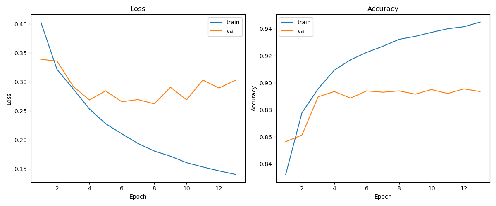
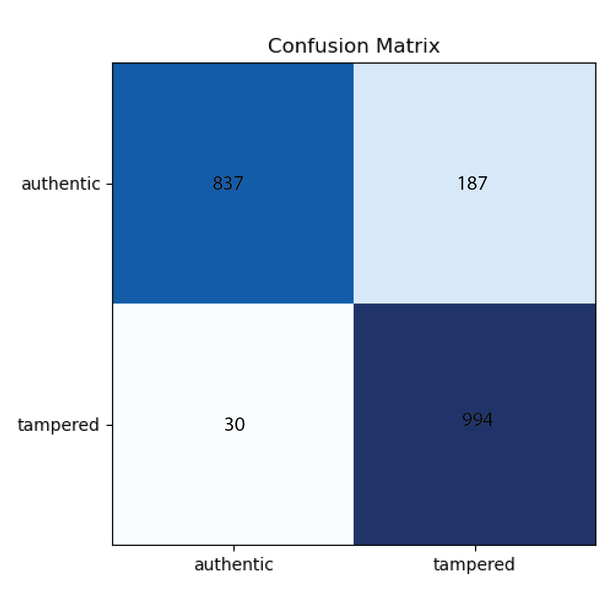

# A Hybrid Approach To Detect Image Tampering Using Deep Learning and ELA

>⚠️ Project Status: This project is still a prototype and is still under development and maintenance.

---

## Description

This project implements a lightweight Convolutional Neural Network (CNN) that automatically checks whether an image has been tampered with using electron. You train the model on examples of both genuine and tampered images, and it learns to pick up subtle artifacts left behind by editing tools using ELA. Once trained, you can feed any new image into the network and it will label it **“Authentic”** or **“Tampered”**.

---

## Key Points

**Architecture**:  
- Two convolutional layers (32 → 64 filters, 5×5 kernels) with ReLU activations  
- 2×2 max-pooling  
- Dropout layers (25% before and 50% before the final dense layer)  
- Dense layer (256 units) + SoftMax classifier  

**Training**:  
- Loss: Sparse Categorical Cross-Entropy  
- Optimizer: RMSprop (learning rate = 1e-4)

**Accuracy**
- 92% on training dataset
- 89% on validation dataset 

 
---

## Features
- **Hybrid ELA + CNN Detection**  
  Preprocesses images with Error Level Analysis to highlight suspect regions, then feeds them into a lightweight Convolutional Neural Network for high-confidence “Authentic” vs “Tampered” classification.

- **End-to-End Electron App**  
  Drag-and-drop interface wrapped in Electron—no command-line fuss. Upload an image, hit “Analyze,” and get instant results with ELA visualization and confidence score.

- **Built-in Metadata & Model Management**  
  Automatically extracts image metadata (dimensions, EXIF tags, file info) alongside tamper results. Save/load your trained `.h5` model and tweak training/inference parameters via simple CLI flags.

---

## 📦 Installation
## Clone this repository:
```bash
git clone https://github.com/akmlalff/A-Hybrid-Approach-To-Detect-Image-Tampering-Using-Deep-Learning-and-ELA.git
cd A-Hybrid-Approach-To-Detect-Image-Tampering-Using-Deep-Learning-and-ELA
```

## Install dependencies:
```bash
pip install -r requirements.txt
npm install
```

## Compile into .exe
```bash
pip install pyinstaller
pyinstaller backend/inference.py --add-data 'models/cnn_tamper.h5;models' --onefile
npm run dist
```

---

## 🎥 Application Demonstration 

```bash
https://youtu.be/rxupJEdonjU
```

---

## 📜 License
This project is open-sourced under the MIT License.
